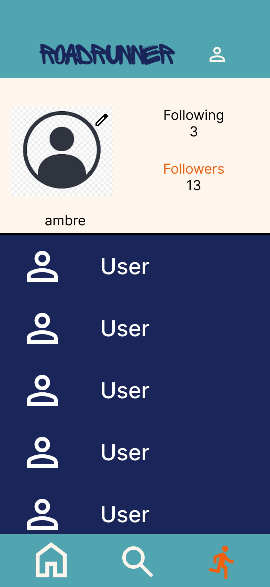

# RoadRunner

Welcome to our running app RoadRunner, this is a <strong><i>Mobile and Tablet</i></strong> app will use your GPS location to track your time, pace, and distance on your run. This app has 9 screens with media queries (for IPhones 12, 14 max pro, XE, XR, IPad Air, IPad Pro, and IPad Mini). 

- User will be able to comment, and like on a run.
- User will be able to save their run after the run is ended.
- User will be able to follow other users on the app.

## Technology and API Used

### FrontEnd
- React
- CSS
- HTML
- JavaScript
- Geolocation API
- MapBox

### BackEnd 

- Django Rest Framework
- PostgresQL
- Python
- Postman

## Team RoadRunner

#### I proudly present the team behind RoadRunner!

<strong>Ambre Tate:</strong> <a href="https://github.com/ambretate">GITHUB</a> 
<strong>John Lopez:</strong> <a href="https://github.com/JLopez0001">GITHUB</a> 
<strong>Semi Adebayo:</strong> <a href="https://github.com/liliaji">GITHUB</a> 
<strong>Luis Payn:</strong>

## Backend Endpoints

| HTTP Verbs | Endpoints | Action |
| --- | --- | --- |
| GET | users/ | To list all users|
| POST | users/login | To find all the events going on |
| POST | users/register/ | To create a new user |
| POST | users/token/refresh/ | Verify user Token
| GET/PUT/DELETE | profile/int:user_id/ | To get the user by user id, to update or to delete the profile   |
| POST | profile/int:follower_profile_id/follow/int:following_profile_id/ | To follow a user |
| GET | profile/int:profile_id/follow-list/ | To get both list of followers, and following |
| DELETE | profile/int:follower_profile_id/follow/int:following_profile_id/ | To unfollow a user |
| GET | runs/feed/ | To get a list of runs on the feed page|
| GET | runs/int:profile_id/ | To get a list of users runs |
| POST | runs/int:profile_id/create/ | To create a run |
| GET/POST | runs/int:run_id/comment/ | To get a list and create a comment based on run id |
| POST/DELETE | runs/int:run_id/like/ | To Like and Unlike a run based on run id |

## ERD
<i>This is our models for the back end</i> 

## WireFrame
<strong>Here are our 9 Screens:</strong>
### Login and Register: 

### Feed:
<i>With comments and likes</i> 

### Profile:
<i>With following and follower list when clicking on either or. (example below) </i> 

### Follower list and Following list:

### Run:
<i>Run Page will have a timer added in final product, you can stop and start a run. It will be posted on the feed page</i> 

### Search:
<i>User can find other users to follow</i> 

### Edit Profile Page:
<i>Update CRUD Functionality</i> 

### Delete Profile Page:
<i>Delete CRUD FUnctionality</i> 

